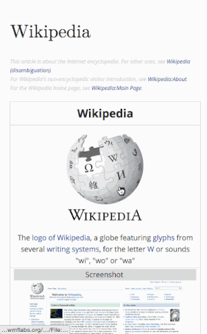

# Features

Here you can find a list of the implemented user facing features at the moment.
For more information about the technical features visit next chapter
[Architecture](./architecture.md).

## Article Reading

---

First visit to an article will show a summarized version to get useful content
to users with bad connections as fast as possible.

The loading strategy (right now opt-in by the user by clicking on read more)
needs to be discussed as different strategies have different trade-offs.

---

Images are lazy loaded when they are closed to the viewport. This way we avoid
blocking rendering and getting the important assets of the site and save on
bandwidth usage of the user and the wikimedia servers.

---

Navigation happens on the client on enabled browsers, meaning you never see
a blank page and perceived speed is greater.

The loading experience will be improved in different ways, for example
pre-fetching link summaries for the current article, using better loading
animations, etc.

---

Client side caching of user accessed data.

When the user visits articles, the content is cached on the client browser, so
when the user goes back to it, either on the same sesion or on a different one,
the loading of the content will be instant since it will already be on their
device.

---

Offline access and caching of the site's shell

The application is fully cached in the client when visited for the first time,
informing the user it is ready for working offline.

After that point, the website is cached, this means it will work fine without
internet, but also that subsequent visits to the site will show the site's
chrome instantly. The article content will be instant too if it was visited
previously, same thing as the images (which are also cached on the client).

The perception of speed is greatly improved after the first visit.

## Next steps

In the user facing features camp there is searching, media gallery, section
collapsing, language selector, etc.

There's also a lot to think about what to load automatically and what to load
when the user requests it.

We'll get to it step by step, ping us in the
[issues](https://github.com/joakin/loot-ui/issues) with any comments you have.
